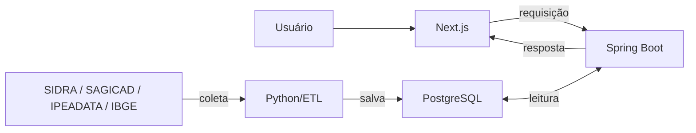

# 🗺️ Mapa Social do Maranhão

O **Mapa Social do Maranhão** é um projeto desenvolvido pelo **NARA - Núcleo de Análise e Recursos Analíticos** juntamente ao **Ministério Público do Maranhão** com o propósito de fornecer visibilidade a dados públicos de **Educação**, **Saúde** e **Assistência Social** para a população e governantes do estado. Dessa forma, proporcionando entendimento da situação dos municípios e do estado, podendo influenciar na tomada de decisões para a melhoria da qualidade de vida da população.

> ⚠️ **Nota**: Esta documentação refere-se à execução local do projeto para desenvolvimento e testes. Futuramente, o Mapa Social do Maranhão será integrado à plataforma oficial do **Ministério Público do Maranhão**.

---

## 📋 Índice

- [Resumo](#-resumo)
- [Importância do Projeto](#-importância-do-projeto)
- [Cobertura dos Dados](#-cobertura-dos-dados)
- [Tecnologias Utilizadas](#-tecnologias-utilizadas)
- [Fluxograma da Aplicação](#-fluxograma-da-aplicação)
- [Estruturação do Projeto](#-estruturação-do-projeto)
- [Endpoints da API](#-endpoints-da-api)
- [Como Rodar a Aplicação](#️-como-rodar-a-aplicação)
- [Testando a API](#-testando-a-api)
- [Integração com o MPMA](#️-integração-com-o-ministério-público-do-maranhão)
- [Desenvolvedores](#-desenvolvedores-e-contato)

---

## 📄 Resumo

- **Objetivo**: Centralizar e visualizar dados públicos de múltiplas fontes governamentais
- **Cobertura**: 217 municípios do Maranhão com mais de 20 indicadores
- **Fontes de Dados**: SIDRA (IBGE), SAGICAD (Cidadania), IPEADATA
- **Público-alvo**: Governantes, pesquisadores, população em geral
- **Tecnologia**: Full-stack moderno (Next.js, Spring Boot, PostgreSQL)
- **Disponibilidade**: API REST documentada, frontend responsivo, dados atualizados automaticamente

---

## 📌 Importância do Projeto

O objetivo do projeto é disponibilizar dados públicos de forma simplificada e confiável para governantes e população, priorizando a transparência das fontes de coleta e o salvamento das informações.

Além disso, a importância do Mapa Social é proporcionar um agrupamento de dados que outrora estavam separados em diferentes órgãos municipais e estaduais. Dessa forma, simplificando o processo de coleta e visualização.

---

## 📶 Cobertura dos Dados

> Todos os dados obtidos podem ser encontrados em suas respectivas fontes originais. Priorizamos somente fontes confiáveis.

- **SIDRA** — https://sidra.ibge.gov.br/acervo#/S/Q
- **SAGICAD** — https://aplicacoes.cidadania.gov.br/vis/data3/data-explorer.php
- **IPEADATA** — https://www.ipeadata.gov.br/Default.aspx
- **IBGE Cidades** — https://cidades.ibge.gov.br/

### 👥 Demográficos

| Fonte | Indicador | Formato |
| :---- | :-------: | ------: |
| SIDRA | População Residente | CSV |
| SIDRA | Quantidade de Homens | CSV |
| SIDRA | Quantidade de Mulheres | CSV |
| SIDRA | Quantidade de Residentes Urbanos | CSV |
| SIDRA | Quantidade de Residentes Rurais | CSV |
| SIDRA | População Residente em Favelas | CSV |
| IPEADATA | Índice de Desenvolvimento Humano | CSV |

### 🗺️ Geográficos

| Fonte | Indicador | Formato |
| :---- | :-------: | ------: |
| SIDRA | Área Territorial | CSV |
| SIDRA | Densidade Demográfica | CSV |

### 💰 Econômicos

| Fonte | Indicador | Formato |
| :---- | :-------: | ------: |
| SIDRA | Produto Interno Bruto | CSV |

### 📚 Educação

> 🚧 Indicadores de educação em desenvolvimento. Serão adicionados em breve.

### 🏥 Saúde

| Fonte | Indicador | Formato |
| :---- | :-------: | ------: |
| SIDRA | Percentual de Envelhecimento | CSV |
| SIDRA | Idade Mediana | CSV |
| SIDRA | Pessoas de 2 Anos ou Mais com Deficiência | CSV |

### 🤝 Assistência Social

| Fonte | Indicador | Formato |
| :---- | :-------: | ------: |
| SAGICAD | Total de Famílias Inscritas no Cadastro Único | CSV |
| SAGICAD | Famílias em Situação de Trabalho Infantil — Cadastro Único | CSV |
| SAGICAD | Famílias em Situação de Rua Inscritas no Cadastro Único | CSV |
| SAGICAD | Programa Auxílio Gás para Brasileiros | CSV |
| SAGICAD | Pessoas Inscritas no Cadastro Único por Sexo | CSV |
| SAGICAD | Pessoas Inscritas no Cadastro Único por Raça e Cor | CSV |
| SAGICAD | Pessoas com Deficiência Cadastradas no Cadastro Único | CSV |
| IPEADATA | Domicílios com Água Encanada | CSV |
| IPEADATA | Domicílios com Energia Elétrica | CSV |

---

## 💻 Tecnologias Utilizadas

      

> A fim de proporcionar manutenibilidade e escalabilidade da aplicação para futuras atualizações e acervo de diferentes dados, estas são as tecnologias que utilizamos no desenvolvimento do projeto:

**Frontend**
- **Next.js** — Framework focado na criação de aplicações web responsivas e ágeis para dispositivos móveis e desktop.
- **TailwindCSS** — Estilização do Mapa Social com praticidade no desenvolvimento para dispositivos móveis.

**Backend**
- **Spring Boot** — Framework utilizado na criação de APIs escaláveis, seguras e de fácil manutenção, com bom suporte para grandes volumes de requisições de dados.
- **Java** — Linguagem de programação confiável no mercado, priorizando robustez e tipagem forte.
- **Python** — Linguagem de programação muito utilizada em análise de dados, com suporte a processos de aprendizado de máquina e processamento de linguagem natural.

**Dados**
- **PostgreSQL** — Banco de dados relacional que prioriza escalabilidade e suporte a grandes fluxos de dados, realizando consultas de forma rápida e segura.
- **Pandas** — Biblioteca utilizada no processo de ETL (Extração, Transformação e Carregamento) dos dados, oferecendo suporte a diferentes tipos e formatos de dados.

---

## 🔄 Fluxograma da Aplicação

> Todo o processo de coleta, tratamento, salvamento e visualização dos dados é feito de forma automatizada e assíncrona.



---

## 📁 Estruturação do Projeto

```
📦 MAPA SOCIAL DO MARANHÃO
    ├── 📂 frontend (Next.js + TypeScript)
    │   ├── app/                          # Layout principal e páginas
    │   ├── components/                   # Componentes React reutilizáveis
    │   │   ├── MapaComponent.tsx         # Visualização de dados geográficos
    │   │   ├── GraficoCompativoComponent.tsx # Gráficos comparativos
    │   │   ├── IndicadoresPrincipaisComponent.tsx # KPIs principais
    │   │   └── ...
    │   ├── utils/                        # Utilitários e helpers
    │   ├── .env.local                    # Variáveis de ambiente (não versionado)
    │   └── package.json                  # Dependências do frontend
    │
    ├── 📂 backend (Spring Boot + Java)
    │   ├── src/main/java/mpma/mapa/
    │   │   ├── controllers/              # Endpoints da API REST
    │   │   │   ├── DemograficosController.java
    │   │   │   ├── GeograficosController.java
    │   │   │   ├── EconomicosController.java
    │   │   │   ├── SaudeController.java
    │   │   │   ├── EstadualController.java
    │   │   │   └── ...
    │   │   ├── service/                  # Lógica de negócio
    │   │   ├── repository/               # Acesso a dados (JPA)
    │   │   ├── entity/                   # Modelos JPA
    │   │   └── config/                   # Configurações do Spring
    │   ├── pom.xml                       # Dependências do backend
    │   └── mvnw                          # Maven wrapper
    │
    └── 📂 pipeline (Python)
        ├── main.py                       # Script principal de ETL
        ├── fluxo/
        │   ├── coleta.py                 # Coleta de dados das APIs
        │   ├── tratamento.py             # Limpeza e transformação
        │   └── salvamento.py             # Persistência em banco de dados
        ├── tratamentos/                  # Tratamentos por fonte de dados
        │   ├── SIDRA.py
        │   ├── SAGICAD.py
        │   ├── IPEADATA.py
        │   └── AprendizadoQEDU.py
        ├── apoio/                        # Funções auxiliares
        ├── informacoes/                  # Dados de referência
        ├── config/                       # Configurações de Loggers e arquivos
        └── requirements.txt              # Dependências Python
```

---

## 🔌 Endpoints da API

### Base URL: `http://localhost:8080`

#### 📊 Dados Estaduais

| Método | Endpoint | Descrição | Parâmetros |
| :----: | :------- | :-------: | ---------: |
| GET | `/estadual/municipios` | Lista todos os municípios do Maranhão | — |

#### 👥 Dados Demográficos

| Método | Endpoint | Descrição | Parâmetros |
| :----: | :------- | :-------: | ---------: |
| GET | `/demograficos/populacao` | População total de um município | `municipio` (string) |
| GET | `/demograficos/populacaoEstadualRecente` | População total do estado | — |
| GET | `/demograficos/quantidadeDeHomens` | Quantidade de homens por município | `municipio` (string) |
| GET | `/demograficos/quantidadeDeMulheres` | Quantidade de mulheres por município | `municipio` (string) |
| GET | `/demograficos/idh` | Índice de Desenvolvimento Humano | `municipio` (string) |
| GET | `/demograficos/quantidadeDeResidentesRurais` | Quantidade de residentes rurais | `municipio` (string) |
| GET | `/demograficos/evolucaoIDH` | Evolução do Índice de Desenvolvimento Humano | `municipio` (string) |

#### 🗺️ Dados Geográficos

| Método | Endpoint | Descrição | Parâmetros |
| :----: | :------- | :-------: | ---------: |
| GET | `/geograficos/areaTotal` | Área territorial de um município (km²) | `municipio` (string) |
| GET | `/geograficos/densidadeDemografica` | Densidade demográfica (hab/km²) | `municipio` (string) |

#### 💰 Dados Econômicos

| Método | Endpoint | Descrição | Parâmetros |
| :----: | :------- | :-------: | ---------: |
| GET | `/economicos/produtoInternoBruto` | PIB municipal | `municipio` (string) |
| GET | `/economicos/produtoInternoBrutoAgregadoEstadual` | PIB agregado do estado | — |

#### 🏥 Dados de Saúde

| Método | Endpoint | Descrição | Parâmetros |
| :----: | :------- | :-------: | ---------: |
| GET | `/saude/idadeMediana` | Idade mediana da população | `municipio` (string) |

#### 📋 Informações Gerais

| Método | Endpoint | Descrição | Parâmetros |
| :----: | :------- | :-------: | ---------: |
| GET | `/informacoes/dadosPrincipaisMunicipal` | Dados principais de um município | `municipio` (string) |

---

## 🛠️ Como Rodar a Aplicação

> Para executar a aplicação com sucesso são necessárias as seguintes tecnologias:

| Tecnologia | Versão Recomendada |
| :--------- | :----------------: |
| Node.js | 18+ |
| Python | 3.11+ |
| Java (JDK) | 17+ |
| Docker | 24+ |

**Todas as tecnologias podem ser baixadas nos respectivos links abaixo:**
- [Node.js](https://nodejs.org/en/download) — necessário para rodar o Next.js
- [Python](https://www.python.org/downloads)
- [Java JDK 17](https://www.oracle.com/java/technologies/downloads/#java17)
- [Docker](https://www.docker.com/products/docker-desktop)

---

### 📥 1 — Clonar o repositório

```bash
git clone https://github.com/GRUPO-NARA/mapa-social-do-maranhao.git
```

### 📂 2 — Entrar na pasta do projeto

```bash
cd mapa-social-do-maranhao
```

---

### ⚙️ Configuração de Variáveis de Ambiente

O repositório contém exemplos de arquivos `.env` com os modelos necessários. Copie cada um, renomeie removendo o `.exemplo` e preencha com os seus valores.

### 3 — Criar o arquivo `.env` na raiz do projeto

```bash
cp .env.exemplo .env
```

O arquivo `.env.exemplo` contém todas as variáveis necessárias para execução do projeto:

```env
# PostgreSQL
POSTGRES_USER=postgres
POSTGRES_PASSWORD=sua_senha_aqui
POSTGRES_DB=postgres

# Pipeline (Python)
SQLALCHEMY_DATABASE_URI=postgresql+psycopg2://postgres:sua_senha_aqui@db:5432/postgres

# Backend (Spring Boot)
SPRING_DATASOURCE_URL=jdbc:postgresql://db:5432/postgres
SPRING_DATASOURCE_USERNAME=postgres
SPRING_DATASOURCE_PASSWORD=sua_senha_aqui

BACKEND_PORT=8080
BACKEND_HOST=0.0.0.0

# Frontend
NEXT_PUBLIC_API_URL=http://localhost:8080

# CORS
CORS_ALLOWED_ORIGINS=http://localhost:3000
```

Para ambiente de desenvolvimento local, basta substituir `sua_senha_aqui` pela senha desejada do PostgreSQL.

### 4 — Criar o arquivo `.env.local` na pasta `/frontend`

```bash
cd frontend
cp .env.local.exemplo .env.local
```

Conteúdo do arquivo:

```env
NEXT_PUBLIC_API_URL=http://localhost:8080
```

Essa variável informa ao frontend onde a API Spring Boot está disponível durante o desenvolvimento local.

---

### 📦 Instalação de Dependências

### 5 — Instalar dependências do Frontend

> Dentro da pasta `/frontend`, execute:

```bash
npm install
```

### 6 — Instalar dependências do ETL (Python)

> Acesse a pasta `/ETL`:

```bash
cd ../ETL
```

> Crie um ambiente virtual:

**Windows:**
```bash
python -m venv .venv
```

**Linux/Mac:**
```bash
python3 -m venv .venv
```

> Ative o ambiente virtual:

**Windows:**
```bash
.venv\Scripts\activate
```

**Linux/Mac:**
```bash
source .venv/bin/activate
```

> Instale as dependências:

```bash
pip install -r requirements.txt
```

### 7 — Instalar dependências do Backend

> Acesse a pasta `/backend` e execute:

```bash
cd ../backend
./mvnw install
```

---

### 🚀 Executando a Aplicação

#### Com Docker (Recomendado)

Com o Docker instalado, na raiz do projeto execute:

```bash
docker compose --env-file .env up --build -d
```


#### Serviços Docker

Isso sobe todos os serviços automaticamente:

| Serviço | Endereço | Descrição |
| :------ | :------: | --------: |
| Frontend (Next.js) | http://localhost:3000 | Visualização dos dados |
| Backend (Spring Boot) | http://localhost:8080 | API REST |
| Swagger (Documentação) | http://localhost:8080/swagger-ui.html | Documentação interativa dos endpoints |
| Banco de Dados (PostgreSQL) | localhost:5432 | Base de dados |

> Caso prefira rodar sem Docker, execute cada serviço separadamente seguindo os passos acima.

---

## 🧪 Testando a API

### Usando o Swagger UI

Acesse `http://localhost:8080/swagger-ui.html` para testar os endpoints interativamente.

### Usando curl

```bash
# Listar todos os municípios
curl "http://localhost:8080/estadual/municipios"

# Buscar população de um município
curl "http://localhost:8080/demograficos/populacao?municipio=São%20Luís"

# Buscar PIB municipal
curl "http://localhost:8080/economicos/produtoInternoBruto?municipio=São%20Luís"

# Buscar idade mediana
curl "http://localhost:8080/saude/idadeMediana?municipio=São%20Luís"
```

### Usando Postman/Insomnia

Importe a base URL http://localhost:8080 e teste os endpoints listados na seção [Endpoints da API](#-endpoints-da-api).

---

## 🏛️ Integração com o Ministério Público do Maranhão

Este projeto está em desenvolvimento e futuramente será integrado à plataforma oficial do **Ministério Público do Maranhão (MPMA)**, permitindo que gestores públicos e a sociedade acessem dados sociais consolidados de forma centralizada e segura.

---

## 👨‍💻 Desenvolvedores e Contato

> Todos os desenvolvedores fazem parte do **Núcleo de Análise e Recursos Analíticos — NARA**, grupo de discentes do curso de Engenharia da Computação da **Universidade Estadual do Maranhão (UEMA)**. Este projeto é fruto da união de esforços do nosso grupo com o **Ministério Público do Maranhão — MPMA**.

| Membro | Função | GitHub |
| :----- | :----- | :----: |
| Júlio César | FullStack & Gestão | [@JulioCesra](https://github.com/JulioCesra) |
| Carlos Vinícius | Frontend | [@amorimcarlos](https://github.com/amorimcarlos) |
| Bruno Raphael | Backend | [@BrunoAndrade-dev](https://github.com/BrunoAndrade-dev) |
| Ana Elise | Backend | [@elisasilva06](https://github.com/elisasilva06) |